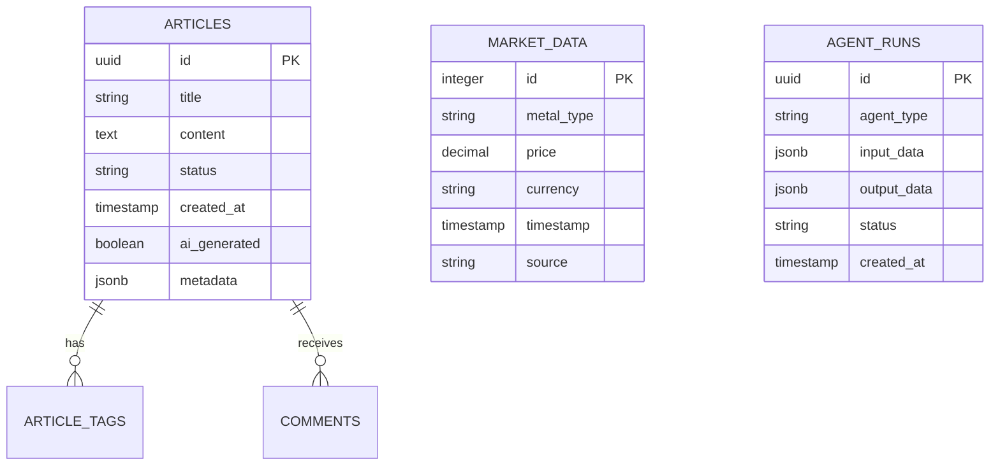

# Database - Precious Market Watch

PostgreSQL database schema and migrations for Precious Market Watch.

## 🗄️ Database Schema

### Core Tables
```sql
-- Articles table
CREATE TABLE articles (
    id UUID PRIMARY KEY DEFAULT gen_random_uuid(),
    title VARCHAR(500) NOT NULL,
    content TEXT NOT NULL,
    status VARCHAR(50) DEFAULT 'draft',
    created_at TIMESTAMP DEFAULT NOW(),
    ai_generated BOOLEAN DEFAULT false,
    metadata JSONB
);

-- Market data table
CREATE TABLE market_data (
    id SERIAL PRIMARY KEY,
    metal_type VARCHAR(50),
    price DECIMAL(10,2),
    currency VARCHAR(10),
    timestamp TIMESTAMP DEFAULT NOW(),
    source VARCHAR(100)
);

-- AI agent runs
CREATE TABLE agent_runs (
    id UUID PRIMARY KEY DEFAULT gen_random_uuid(),
    agent_type VARCHAR(100),
    input_data JSONB,
    output_data JSONB,
    status VARCHAR(50),
    created_at TIMESTAMP DEFAULT NOW()
);
```

## 🚀 Setup

```bash
# Using Docker
docker run --name precious-market-db \
  -e POSTGRES_PASSWORD=securepassword \
  -e POSTGRES_DB=preciousmarket \
  -p 5432:5432 \
  -d postgres:15

# Run migrations
cd database
psql -h localhost -U postgres -d preciousmarket -f migrations/001_initial_schema.sql
```
## 📊 Database Diagram



### 🔄 Migrations

```bash
# Create new migration
npm run migrate:create add_user_preferences

# Run migrations
npm run migrate:up

# Rollback last migration
npm run migrate:down
```

## 📈 Performance Optimization

- Indexing strategy for common queries

- Partitioning for time-series data

- Connection pooling with PgBouncer

- Read replicas for analytics queries

[Continue with backup procedures, monitoring, security...]
