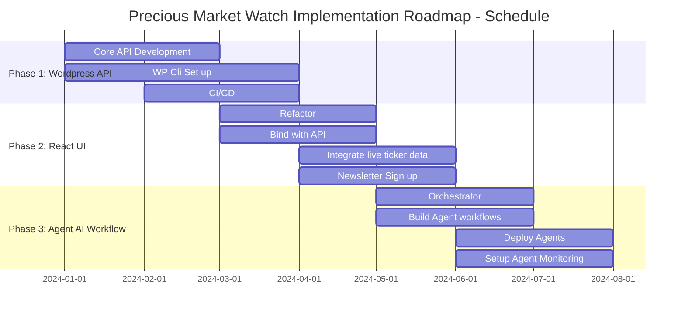

# Problem Statement
## Current Landscape
Affiliate blogs in the precious metals and gemstones niche face significant challenges: content creation is time-intensive, keeping up with market trends requires constant monitoring, and maintaining technical SEO while producing engaging, factual content demands substantial resources. Traditional WordPress sites struggle to dynamically update content based on real-time market data, mining developments, and storage innovations.

## Core Problem
There is no integrated, AI-powered solution that combines automated research, intelligent content generation, and modern web presentation specifically for the precious metals affiliate space. Blog owners must manually:

- Research constantly evolving market data and industry news

- Create educational content across the entire lifecycle (mining → storage)

- Maintain separate systems for content management and marketing

- Manually optimize for SEO and user engagement

## Proposed Solution
A modern, AI-supported WordPress affiliate blog platform that automates content creation while maintaining factual accuracy and engaging presentation. The system will:

1. **Automate Research:** Use AI agents to gather current information about precious metals and gemstones

2. **Generate Quality Content:** Produce well-researched blog posts, social media content, and marketing materials

3. **Modern Presentation:** Deliver content through a React frontend with WordPress serving as a headless CMS

4. **Scalable Architecture:** Support future expansion to additional content types and marketing channels

## Technical Components
- **Frontend:** React-based UI for optimal user experience

- **Backend API:** WordPress/MySQL as headless GraphQL CMS

- **AI Engine:** Python/LangChain/LangGraph agent workflow with MySQL

- **Content Pipeline:** Topic Definition → Research → Fact-checking → Content Review → Generation → Publishing (Human in the middle)

## User Stories
### Content Manager User Stories
1. **Automated Content Planning**

- As a content manager, I want AI to generate content calendars based on market trends, so I can maintain consistent publishing without daily manual planning

2. **Research Automation**

- As a researcher, I want AI agents to gather current information about precious metal prices, mining developments, and storage innovations, so I have up-to-date data without manual monitoring

3. **Fact-Checked Content Generation**

- As an editor, I want AI to generate blog posts with verified sources and citations, so I can trust the accuracy while reducing writing time

4. **Multi-Platform Content**

- As a marketing manager, I want AI to adapt blog content into social media posts and email newsletters, so I can maintain consistent messaging across channels

5. **Content Publishing**

- As a marketing manager, I want to have complete control over content publishing, with scheduled posts, on demand posts and with the ability to view and manage schedules it would be nice to be able to control whether the post is automated or requires a human to verify before going live.

## Technical User Stories
5. **Headless CMS Integration**

- As a developer, I want WordPress to serve as a headless GraphQL API, so I can build a modern React frontend while maintaining familiar content management

6. **Agent Workflow Management**

- As a system administrator, I want to monitor and adjust the Python-based agent workflow, so I can ensure reliable content generation and posting

7. **Database Performance**

- As a database administrator, I want a optimized MySQL database, so the system handles concurrent research and content serving efficiently

## Business Owner User Stories
8. **Affiliate Revenue Optimization**

- As a business owner, I want AI to identify and integrate relevant affiliate opportunities, so I maximize revenue from educational content

9. **SEO Automation**

- As an SEO specialist, I want AI to optimize content for search engines, so the blog maintains strong organic visibility with less manual intervention

10. **Performance Analytics**

- As an analyst, I want integrated analytics showing content performance and revenue impact, so I can make data-driven decisions about content strategy

## Reader/Visitor User Stories
11. **Current, Accurate Information**

- As a precious metals investor, I want access to up-to-date market information and educational content, so I can make informed decisions

12. **Engaging Presentation**

- As a website visitor, I want a fast, modern interface with well-organized information, so I can easily find and consume content

13. **Comprehensive Lifecycle Education**

- As a student/researcher, I want detailed information about the entire precious metals lifecycle, so I can understand the industry from mining to storage

## Success Metrics
- 80% reduction in manual content research time

- Daily automated posting of 2-3 quality articles

- 40% increase in organic traffic within 6 months

- 30% growth in affiliate revenue quarter-over-quarter

- Sub-2-second page load times for blog content

- 95%+ factual accuracy in AI-generated content

Repository Structure Recommendation:

```text
├── /frontend/         # React UI application
├── /backend/          # Headless WordPress setup
├── /agents/           # Python LangChain/LangGraph agents
├── /database/         # MySQL schemas for Wordpress and Agents
├── /docs/             # Project documentation
├── /deployment/       # Docker/CI/CD configurations
└── /tests/            # e2e tests
```

