# PreciousMarketWatch — Agent Specification

> **Companion document to SYSTEM-DESIGN.md**  
> **Covers:** Scoring Model · Prompt Templates · Dashboard UI & State · Environment Config · Failure Log Format  
> **Last Updated:** 2026-02

---

## Section 9. Scoring Model

> Derived from POC research: each agent scores its own output against criteria that measure the output's ability to use topic data, current facts, and trending news to **generate buying intent around the specific affiliate being promoted**. Each phase has its own criteria set because what "good" means changes at each stage of the pipeline.

---

### 9a. Scoring Philosophy

The scoring model answers one question at each stage:

> *"Does this output give the next agent in the pipeline enough signal to move the reader from awareness → consideration → purchase intent for the affiliate product?"*

A research output that scores 0.82 is not "82% complete" — it means the research bundle contains sufficient factual density, recency, and affiliate relevance to be a strong foundation for content planning. The score is a **gate condition**, not a quality grade.


---

### 9b. Research Agent — Scoring Rubric

**What is being scored:** The research bundle returned by the agent — a collection of facts, news items, price data, and trend signals gathered for the topic.

**Judge Agent prompt:** The research output is passed to a higher-reasoning model (Judge Agent) that evaluates it against the criteria below.

| Criterion | Weight | What it measures | Poor (0.0–0.4) | Good (0.7–1.0) |
|-----------|--------|-----------------|----------------|----------------|
| `source_count` | 15% | Minimum 5 distinct, citable sources | < 3 sources | 5+ authoritative sources |
| `recency` | 20% | At least 3 sources from last 30 days | All sources > 60 days old | 3+ sources < 14 days old |
| `relevance` | 25% | Sources directly address the topic AND target keyword | Tangential only | Direct keyword + topic match |
| `affiliate_context` | 25% | Facts that create a problem the affiliate product solves | No affiliate angle | Strong problem/solution signal for the affiliate |
| `factual_density` | 15% | Concrete data: prices, percentages, named events | Vague generalities | Specific numbers, dates, named sources |

**Composite score formula:**
```
research_score = (source_count × 0.15) + (recency × 0.20) + (relevance × 0.25)
               + (affiliate_context × 0.25) + (factual_density × 0.15)
```

**Threshold:** `0.75` (configurable per agent record in `pmw_agents.config`)

**Retry behaviour:** On each retry the agent widens its search parameters — longer date range, broader keyword variants, additional news sources. The research payload passed to the Judge Agent includes which search terms were used so the Judge can weight recency of the attempt.

---

### 9c. Content Planning Agent — Scoring Rubric

**What is being scored:** The content plan produced by the agent — title, key points, section structure, FAQ suggestions, affiliate placement strategy, and SEO metadata.

| Criterion | Weight | What it measures | Poor (0.0–0.4) | Good (0.7–1.0) |
|-----------|--------|-----------------|----------------|----------------|
| `problem_solution_flow` | 25% | Does the plan move from reader problem → affiliate solution naturally? | No clear flow | Explicit problem → solution arc |
| `affiliate_integration` | 25% | Are affiliate mentions planned at natural conversion points? | No placement strategy | 3+ placements at high-intent moments |
| `seo_alignment` | 20% | Do title, headings, and keywords align with target keyword and search intent? | No keyword in title | Primary keyword in title + 2 H2s |
| `content_depth` | 15% | Does the plan cover enough unique angles to fill 800–1200 words without padding? | 2 key points or fewer | 4–5 distinct angles with supporting data |
| `conversion_elements` | 15% | Are CTAs, FAQs, and social hooks present and mapped to buying stages? | No CTAs planned | CTAs + 3 FAQs mapped to objections |

**Composite score formula:**
```
planning_score = (problem_solution_flow × 0.25) + (affiliate_integration × 0.25)
               + (seo_alignment × 0.20) + (content_depth × 0.15)
               + (conversion_elements × 0.15)
```

**Threshold:** `0.80`

**Retry behaviour:** On retry the agent is given its previous plan plus the Judge's `improvement_suggestions` field. It regenerates with explicit instructions to address the weak criteria. The score breakdown from the failed attempt is included in the retry prompt.

---

### 9d. Content Generation Agent — Scoring Rubric

**What is being scored:** The full article draft — title, body content, FAQs, meta description, CTAs, and affiliate link placement.

| Criterion | Weight | What it measures | Poor (0.0–0.4) | Good (0.7–1.0) |
|-----------|--------|-----------------|----------------|----------------|
| `buying_intent_strength` | 30% | Does the content create desire for the affiliate product at multiple points? | Product never mentioned naturally | 3+ natural mentions at high-intent paragraphs |
| `factual_accuracy` | 20% | Are facts from the research bundle used correctly and cited? | No facts used | 5+ specific facts from research bundle |
| `keyword_integration` | 15% | Is the primary keyword used naturally without stuffing? | Missing or overused | In title, first paragraph, 2 H2s, meta |
| `readability` | 15% | Is the content scannable, well-structured, and free of padding? | Walls of text, no structure | Clear H2/H3 structure, short paragraphs |
| `cta_effectiveness` | 10% | Is the final CTA specific, low-friction, and tied to the affiliate? | Generic or absent | Specific offer, named product, one action |
| `faq_quality` | 10% | Do FAQs address real objections that block purchase? | Generic questions | Objection-handling FAQs with affiliate answer |

**Composite score formula:**
```
content_score = (buying_intent_strength × 0.30) + (factual_accuracy × 0.20)
              + (keyword_integration × 0.15) + (readability × 0.15)
              + (cta_effectiveness × 0.10) + (faq_quality × 0.10)
```

**Threshold:** `0.80`

**Retry behaviour:** Full article regeneration with the Judge's feedback. The retry prompt includes: original plan, failed draft summary (not the full draft — token cost), score breakdown, and specific improvement instructions per weak criterion.

---

### 9e. Judge Agent — Configuration

The Judge Agent is a separate LLM call made by the Orchestrator after each agent completes its work. It is not an agent in the pipeline — it is an evaluation function.

```json
{
  "judge_agent": {
    "model": "claude-opus-4-6",
    "temperature": 0.1,
    "role": "You are a conversion-focused content evaluator for an affiliate marketing platform in the precious metals and gemstones niche. Your role is to score agent outputs against defined criteria and return structured JSON only. You do not generate content — you evaluate it.",
    "output_format": {
      "score": "float 0.0–1.0",
      "passed": "boolean",
      "breakdown": [
        { "criterion": "string", "score": "float", "reasoning": "string" }
      ],
      "improvement_suggestions": ["string"],
      "retry_instructions": "string — specific instructions for the next attempt"
    }
  }
}
```

> **Model choice rationale:** The Judge uses a higher-reasoning model than the pipeline agents because scoring requires nuanced judgment about affiliate relevance and buying intent — not creative generation. A wrong score in either direction is expensive: too lenient and low-quality content publishes; too strict and the pipeline loops indefinitely.

---

### 9f. Score Thresholds — Configuration Table

All thresholds are stored in `pmw_agents.config` and can be overridden per run via `POST /workflows/trigger { overrides }`.

| Agent | Default Threshold | Max Retries | Retry Strategy |
|-------|------------------|-------------|----------------|
| Task Loader | N/A (validation only) | 0 | Fix data, re-trigger |
| Research Agent | 0.75 | 3 | Widen search, new sources |
| Content Planning Agent | 0.80 | 3 | Apply Judge feedback |
| Content Generation Agent | 0.80 | 3 | Apply Judge feedback |
| Publishing Agent | N/A (WP API success) | 2 | Network retry only |

---

## Section 10. Prompt Template Structure

> Prompt templates are stored as JSON in `pmw_agents.config.prompt_templates`. Each template uses `{{ variable }}` placeholders that the agent fills at runtime. Templates are versioned — the `prompt_hash` stored in `pmw_task_queue` is a sha256 of the fully-rendered prompt (post variable substitution), not the template itself.

---

### 10a. Template Architecture


---

### 10b. Research Agent Prompt Template

```json
{
  "system": "You are a market research specialist for the precious metals and gemstones industry. Your task is to gather and structure research material that will be used to create affiliate marketing content. You focus on finding facts, trends, and news that create awareness of problems the reader faces and that position the affiliate product as a solution. Always return valid JSON matching the output schema. Never include commentary outside the JSON.",

  "user": "TOPIC: {{ topic_name }}\nCATEGORY: {{ topic_category }}\nTARGET KEYWORD: {{ target_keyword }}\nAFFILIATE PRODUCT: {{ affiliate_name }}\nAFFILIATE URL: {{ affiliate_url }}\nAFFILIATE VALUE PROPOSITION: {{ affiliate_value_prop }}\n\nGATHER RESEARCH COVERING:\n1. Current price data and recent movements for {{ topic_name }}\n2. Minimum 5 news items from the last 30 days referencing {{ target_keyword }}\n3. Trending search queries related to {{ topic_name }}\n4. Common reader problems this topic addresses (relate to {{ affiliate_name }})\n5. Supporting statistics that create urgency or credibility\n\nFor each piece of research, note its relevance to driving purchase intent for {{ affiliate_name }}.\n\nOUTPUT SCHEMA:\n{{ output_schema }}",

  "output_schema": {
    "price_data": {
      "current_price": "string",
      "30_day_change": "string",
      "source": "string",
      "retrieved_at": "ISO8601"
    },
    "news_items": [
      {
        "title": "string",
        "summary": "string",
        "source": "string",
        "published_at": "ISO8601",
        "affiliate_relevance": "string — how this creates buying intent for the affiliate"
      }
    ],
    "trending_queries": ["string"],
    "reader_problems": [
      {
        "problem": "string",
        "affiliate_solution": "string — how the affiliate product solves this"
      }
    ],
    "supporting_statistics": [
      {
        "stat": "string",
        "source": "string",
        "buying_intent_angle": "string"
      }
    ]
  }
}
```

---

### 10c. Content Planning Agent Prompt Template

```json
{
  "system": "You are a senior content strategist for an affiliate marketing blog in the precious metals and gemstones niche. You receive research bundles and produce structured content plans designed to move readers from problem awareness to purchase consideration. Your plans must have a clear problem-to-solution narrative arc that naturally introduces the affiliate product at high-intent moments. Always return valid JSON matching the output schema. Never include commentary outside the JSON.",

  "user": "TOPIC: {{ topic_name }}\nTARGET KEYWORD: {{ target_keyword }}\nAFFILIATE PRODUCT: {{ affiliate_name }}\nAFFILIATE VALUE PROPOSITION: {{ affiliate_value_prop }}\nTARGET WORD COUNT: 800–1200 words\n\nRESEARCH BUNDLE:\n{{ research_output_json }}\n\nPLANNING REQUIREMENTS:\n1. The title must include {{ target_keyword }} and create urgency or curiosity\n2. The structure must follow: Problem Identification → Context/Stakes → Solution Introduction → Affiliate as Solution → Social Proof → CTA\n3. Plan at least 3 natural affiliate mention points — note the paragraph index for each\n4. FAQs must address purchase objections, not just general questions\n5. SEO metadata must reflect search intent for {{ target_keyword }}\n\nOUTPUT SCHEMA:\n{{ output_schema }}",

  "output_schema": {
    "blog_title": "string — must contain target keyword",
    "narrative_arc": "string — one sentence describing problem-to-solution flow",
    "sections": [
      {
        "heading": "string",
        "purpose": "awareness | context | solution | affiliate | proof | cta",
        "key_points": ["string"],
        "affiliate_mention": "boolean",
        "word_count_target": "int"
      }
    ],
    "target_keywords": {
      "primary": "string",
      "secondary": ["string"]
    },
    "affiliate_placement_plan": [
      {
        "section_index": "int",
        "mention_type": "contextual | comparison | cta | recommendation",
        "suggested_anchor_text": "string"
      }
    ],
    "faq_plan": [
      {
        "question": "string",
        "objection_addressed": "string",
        "affiliate_answer_angle": "string"
      }
    ],
    "seo_metadata": {
      "title_tag": "string — max 60 chars",
      "meta_description": "string — max 155 chars",
      "primary_keyword_placement": ["title", "h1", "first_paragraph", "meta"]
    },
    "image_ideas": ["string"],
    "social_hooks": ["string — opening lines for social posts"]
  }
}
```

---

### 10d. Content Generation Agent Prompt Template

```json
{
  "system": "You are a professional content writer for a precious metals and gemstones affiliate blog. You receive a detailed content plan and a research bundle and write complete, publish-ready blog posts. Your writing is informative, trustworthy, and naturally guides readers toward the affiliate product without feeling salesy. You integrate facts and statistics from the research bundle to build credibility. Always return valid JSON matching the output schema. Never include commentary outside the JSON.",

  "user": "TOPIC: {{ topic_name }}\nTARGET KEYWORD: {{ target_keyword }}\nAFFILIATE PRODUCT: {{ affiliate_name }}\nAFFILIATE URL: {{ affiliate_url }}\nAFFILIATE VALUE PROPOSITION: {{ affiliate_value_prop }}\n\nCONTENT PLAN:\n{{ planning_output_json }}\n\nRESEARCH BUNDLE:\n{{ research_output_json }}\n\nWRITING REQUIREMENTS:\n1. Word count: 800–1200 words (excluding FAQs)\n2. Use HTML heading tags: one H1, H2s for main sections, H3s for subsections\n3. Integrate at least 5 specific facts or statistics from the research bundle with inline attribution\n4. Place affiliate mentions exactly at the paragraph indices specified in the content plan\n5. Each affiliate mention must be contextual — never 'click here', always anchor text describing the product benefit\n6. FAQs must be complete with detailed answers (minimum 50 words each)\n7. The CTA must name the affiliate product and describe one specific benefit\n8. Do not use the phrase 'In conclusion' — use a forward-looking closing paragraph instead\n\nOUTPUT SCHEMA:\n{{ output_schema }}",

  "output_schema": {
    "title": "string — final H1 title",
    "content": "string — full HTML article body",
    "word_count": "int",
    "affiliate_placements": [
      {
        "paragraph_index": "int",
        "anchor_text": "string",
        "url": "string",
        "context": "string — the sentence containing the link"
      }
    ],
    "facts_used": [
      {
        "fact": "string",
        "source": "string",
        "paragraph_index": "int"
      }
    ],
    "faqs": [
      {
        "question": "string",
        "answer": "string — minimum 50 words",
        "affiliate_mention": "boolean"
      }
    ],
    "meta_description": "string — max 155 chars",
    "tags": ["string"],
    "call_to_action": {
      "text": "string",
      "affiliate_url": "string",
      "placement": "end_of_article | sidebar | both"
    }
  }
}
```

---

### 10e. Publishing Agent Prompt Template

The Publishing Agent does not use an LLM — it is a deterministic formatter and API caller. No prompt template required. Its logic:

```python
# Publishing Agent — no LLM involved
# Takes content_output JSON → formats for WordPress REST API → POSTs

def build_wp_payload(content_output: dict, topic: dict) -> dict:
    return {
        "title":          content_output["title"],
        "content":        content_output["content"],
        "status":         "draft",          # human review before publish in v1
        "excerpt":        content_output["meta_description"],
        "tags":           content_output["tags"],
        "meta": {
            "yoast_wpseo_title":            content_output["title"],
            "yoast_wpseo_metadesc":         content_output["meta_description"],
            "pmw_affiliate_placements":     json.dumps(content_output["affiliate_placements"]),
            "pmw_facts_used":               json.dumps(content_output["facts_used"]),
            "pmw_ai_generated":             True,
            "pmw_run_id":                   topic["run_id"],
            "pmw_content_score":            topic["content_score"]
        }
    }
```

> **Note — `status: draft`:** In v1 the Publishing Agent creates a WordPress draft, not a live post. A human reviews before publication. This satisfies EU AI Act Art. 14 (human oversight) and means a bad-scoring article that slipped through cannot go live without a human seeing it. Change to `publish` only when you have sufficient confidence in the scoring model.

---

### 10f. Judge Agent Prompt Template

```json
{
  "system": "You are a conversion-focused content evaluator for an affiliate marketing platform in the precious metals and gemstones niche. You score agent outputs against defined criteria and return structured JSON only. You do not generate content. You evaluate whether the output will effectively move a reader toward purchasing the specified affiliate product. Be rigorous — a score of 0.80 means the output is genuinely ready for the next pipeline stage, not just adequate. Always return valid JSON. Never include commentary outside the JSON.",

  "user": "EVALUATION TASK: Score the following {{ agent_type }} output.\n\nAFFILIATE PRODUCT: {{ affiliate_name }}\nAFFILIATE VALUE PROPOSITION: {{ affiliate_value_prop }}\nTARGET KEYWORD: {{ target_keyword }}\n\nOUTPUT TO EVALUATE:\n{{ agent_output_json }}\n\nSCORING CRITERIA:\n{{ criteria_json }}\n\nFor each criterion score 0.0–1.0 where:\n- 0.0–0.4: Fails to meet the requirement\n- 0.5–0.6: Partially meets the requirement\n- 0.7–0.8: Meets the requirement\n- 0.9–1.0: Exceeds the requirement\n\nPrevious attempt score (if retry): {{ previous_score | default('N/A') }}\nPrevious attempt feedback: {{ previous_feedback | default('N/A') }}\n\nOUTPUT SCHEMA:\n{{ output_schema }}",

  "output_schema": {
    "score": "float 0.0–1.0 — weighted composite",
    "passed": "boolean — score >= threshold",
    "threshold_used": "float",
    "breakdown": [
      {
        "criterion": "string",
        "weight": "float",
        "raw_score": "float 0.0–1.0",
        "weighted_score": "float",
        "reasoning": "string — specific, actionable"
      }
    ],
    "improvement_suggestions": ["string — specific to weak criteria"],
    "retry_instructions": "string — exact instructions for next attempt to address the lowest-scoring criteria first"
  }
}
```

---

## Section 11. Agent Dashboard UI — Wireframes & State Model

---

### 11a. Application State Model

> The dashboard is a React application with a single global state tree. All WebSocket events mutate state through a reducer. No local component state is used for data that needs to persist across navigation.


**State transitions driven by WebSocket events:**

| WS Event | State mutation |
|----------|---------------|
| `stage.started` | `activeRun.stages[n].status = 'running'` |
| `stage.complete` | `activeRun.stages[n].status = 'complete'`, `score`, `attempts` written |
| `stage.retry` | `activeRun.stages[n].attempts++`, `last_score` written |
| `stage.awaiting_restart` | `activeRun.stages[n].status = 'awaiting_restart'`, show restart UI |
| `run.complete` | `activeRun.status = 'complete'`, `wp_post_id` written, move to runs list |
| `run.failed` | `activeRun.status = 'failed'`, `failed_at_stage` written, notification added |
| `intervention.applied` | `activeRun.stages[n].status = 'intervened'`, resume next stage |
| `run.killed` | `activeRun.status = 'killed'`, all stages halted |

---

### 11b. Screen Map


---

### 11c. Dashboard Home — Wireframe

```
┌─────────────────────────────────────────────────────────────────┐
│  PreciousMarketWatch Dashboard          [User: Admin] [Logout]  │
├──────────────┬──────────────────────────────────────────────────┤
│              │  TODAY — Thu 19 Feb 2026                          │
│  Dashboard   │                                                   │
│  Run History │  TOPICS SCHEDULED: 3    COMPLETE: 1   FAILED: 0  │
│  Topics      │                                                   │
│  Agents      │ ┌──────────────────────────────────────────────┐ │
│  Audit       │ │ Gold Investment During Inflation              │ │
│              │ │ Status: ✅ Complete  Score: 0.87              │ │
│              │ │ Published: Draft #5821  [View] [Audit Export] │ │
│              │ └──────────────────────────────────────────────┘ │
│              │                                                   │
│              │ ┌──────────────────────────────────────────────┐ │
│              │ │ Diamond Buying Guide 2026                     │ │
│              │ │ Status: 🔄 Running — Content Generation       │ │
│              │ │ Stage 4/5  Attempt 1   Score so far: —        │ │
│              │ │                             [View Live] [Kill] │ │
│              │ └──────────────────────────────────────────────┘ │
│              │                                                   │
│              │ ┌──────────────────────────────────────────────┐ │
│              │ │ Silver Jewellery Trends                       │ │
│              │ │ Status: ⏳ Queued — Scheduled 14:00           │ │
│              │ │                        [Run Now] [Edit Topic] │ │
│              │ └──────────────────────────────────────────────┘ │
│              │                                                   │
│              │  [+ Add Topic]  [Run All Now]                     │
└──────────────┴──────────────────────────────────────────────────┘
```

---

### 11d. Run Detail — Flight Recorder View (Wireframe)

```
┌─────────────────────────────────────────────────────────────────┐
│  ← Back   Run #101 — Gold Investment During Inflation           │
│  Started: 09:00:14   Duration: 14m 32s   Status: ✅ Complete    │
├─────────────────────────────────────────────────────────────────┤
│                                                                  │
│  PIPELINE                                    WS: ● Connected    │
│                                                                  │
│  ① Task Loader        ✅  0.2s                                  │
│    All required fields validated                                 │
│                                                                  │
│  ② Research Agent     ✅  Score: 0.82  Attempt 2/3             │
│    ├─ Attempt 1: 0.61 ✗  [Expand]                              │
│    └─ Attempt 2: 0.82 ✓  [Expand ▼]                           │
│       source_count:    0.90 ████████████░░░                     │
│       recency:         0.85 ███████████░░░░                     │
│       relevance:       0.80 ██████████░░░░░                     │
│       affiliate_ctx:   0.78 ██████████░░░░░                     │
│       factual_density: 0.79 ██████████░░░░░                     │
│                                                                  │
│  ③ Content Planning   ✅  Score: 0.87  Attempt 1/3             │
│    └─ Attempt 1: 0.87 ✓  [Expand]                              │
│                                                                  │
│  ④ Content Generation ✅  Score: 0.91  Attempt 1/3             │
│    └─ Attempt 1: 0.91 ✓  [Expand]                              │
│                                                                  │
│  ⑤ Publishing         ✅  WP Draft #5821                        │
│    WordPress draft created — awaiting human review              │
│                                                                  │
├─────────────────────────────────────────────────────────────────┤
│  [View WP Draft]  [Export Audit Log]  [View Trace]  [Re-run]    │
└─────────────────────────────────────────────────────────────────┘
```

---

### 11e. Run Detail — Awaiting Restart State (Wireframe)

```
┌─────────────────────────────────────────────────────────────────┐
│  ← Back   Run #103 — Silver Jewellery Trends                   │
│  Started: 10:22:00   Duration: 18m 04s   Status: ⚠️ Paused     │
├─────────────────────────────────────────────────────────────────┤
│                                                                  │
│  ① Task Loader        ✅  0.1s                                  │
│  ② Research Agent     ✅  Score: 0.78  Attempt 2/3             │
│                                                                  │
│  ③ Content Planning   ⚠️  AWAITING RESTART                      │
│    ├─ Attempt 1: 0.63 ✗  affiliate_integration too weak        │
│    ├─ Attempt 2: 0.67 ✗  problem_solution_flow still poor      │
│    └─ Attempt 3: 0.71 ✗  below threshold 0.80                  │
│                                                                  │
│  ┌─────────────────────────────────────────────────────────┐   │
│  │ ⚠️  Max retries reached — human action required          │   │
│  │                                                          │   │
│  │ Judge feedback: "Affiliate integration is weak. The      │   │
│  │ plan introduces the product too late and does not        │   │
│  │ position it as the solution to the identified problem."  │   │
│  │                                                          │   │
│  │ Options:                                                 │   │
│  │ [Restart from Planning]  [Edit & Intervene]  [Kill Run]  │   │
│  │                                                          │   │
│  │ Override threshold for this restart:                     │   │
│  │ [ ] Lower to 0.70 for one attempt  [ ] Keep at 0.80     │   │
│  └─────────────────────────────────────────────────────────┘   │
│                                                                  │
│  ④ Content Generation  ⏸️  Waiting                              │
│  ⑤ Publishing          ⏸️  Waiting                              │
└─────────────────────────────────────────────────────────────────┘
```

---

### 11f. Agent Config Screen — Wireframe

```
┌─────────────────────────────────────────────────────────────────┐
│  Agent Configuration                              [Save All]    │
├─────────────────────────────────────────────────────────────────┤
│                                                                  │
│  RESEARCH AGENT                                                  │
│  Model:       [claude-sonnet-4-6        ▼]                      │
│  Threshold:   [0.75]   Max Retries: [3]                         │
│  Criteria Weights:                                               │
│    source_count      [0.15]  recency       [0.20]               │
│    relevance         [0.25]  affiliate_ctx [0.25]               │
│    factual_density   [0.15]                                      │
│  [Edit Prompt Template]  [Test with last run]                   │
│  ─────────────────────────────────────────────────────────────  │
│                                                                  │
│  CONTENT PLANNING AGENT                                          │
│  Model:       [claude-sonnet-4-6        ▼]                      │
│  Threshold:   [0.80]   Max Retries: [3]                         │
│  [Edit Prompt Template]  [Test with last run]                   │
│  ─────────────────────────────────────────────────────────────  │
│                                                                  │
│  CONTENT GENERATION AGENT                                        │
│  Model:       [claude-sonnet-4-6        ▼]                      │
│  Threshold:   [0.80]   Max Retries: [3]                         │
│  [Edit Prompt Template]  [Test with last run]                   │
│  ─────────────────────────────────────────────────────────────  │
│                                                                  │
│  JUDGE AGENT                                                     │
│  Model:       [claude-opus-4-6          ▼]                      │
│  Temperature: [0.1]                                              │
│  [Edit Prompt Template]                                          │
│                                                                  │
└─────────────────────────────────────────────────────────────────┘
```

---

## Section 12. Environment & Configuration Strategy

---

### 12a. Environment Tiers

| Variable type | Local Dev | Staging | Production |
|--------------|-----------|---------|------------|
| `.env.local` | ✅ Git-ignored | — | — |
| `.env.staging` | — | ✅ CI/CD injected | — |
| `.env.production` | — | — | ✅ Secret manager |
| Committed to repo | ❌ Never | ❌ Never | ❌ Never |

**Rule:** `.env.example` is the only env file committed. It contains every variable name with a placeholder value and a comment. No real values ever touch the repo.

---

### 12b. Master `.env.example`

```bash
# ─── Application ──────────────────────────────────────────────
APP_ENV=development                    # development | staging | production
APP_PORT=3000
APP_SECRET=changeme                    # Used for session signing — rotate in prod

# ─── JWT Auth ─────────────────────────────────────────────────
JWT_SECRET=changeme                    # Min 32 chars — rotate in prod
JWT_EXPIRY=8h                          # Dashboard session length
JWT_REFRESH_EXPIRY=7d

# ─── Database ─────────────────────────────────────────────────
DB_HOST=localhost
DB_PORT=3306
DB_NAME=preciousmarket
DB_USER=pmw_app                        # App user — INSERT/SELECT only on vault
DB_PASSWORD=changeme
DB_READONLY_USER=pmw_readonly          # Compliance export user
DB_READONLY_PASSWORD=changeme
DB_POOL_MIN=2
DB_POOL_MAX=10

# ─── Redis (Object Cache + Vault Queue in production) ─────────
REDIS_HOST=localhost
REDIS_PORT=6379
REDIS_PASSWORD=changeme
REDIS_VAULT_STREAM=vault-events        # Redis Stream name for vault queue

# ─── WordPress ────────────────────────────────────────────────
WP_API_URL=http://localhost:8080/wp-json
WP_API_USER=pmw-agent                  # WP application password user
WP_API_PASSWORD=changeme               # WP application password (not login password)
WP_DEFAULT_POST_STATUS=draft           # draft | publish — keep draft until v2

# ─── LLM API ──────────────────────────────────────────────────
ANTHROPIC_API_KEY=changeme
PIPELINE_MODEL=claude-sonnet-4-6       # Agent pipeline model
JUDGE_MODEL=claude-opus-4-6            # Judge Agent model
JUDGE_TEMPERATURE=0.1

# ─── Scoring Thresholds (overridden by DB config — these are fallback defaults)
RESEARCH_THRESHOLD=0.75
PLANNING_THRESHOLD=0.80
CONTENT_THRESHOLD=0.80
RESEARCH_MAX_RETRIES=3
PLANNING_MAX_RETRIES=3
CONTENT_MAX_RETRIES=3

# ─── Vault Queue ──────────────────────────────────────────────
VAULT_QUEUE_BACKEND=mysql              # mysql | redis
VAULT_POLL_INTERVAL_MS=500
VAULT_MAX_RETRIES=3

# ─── Failure Logging ──────────────────────────────────────────
LOG_LEVEL=info                         # debug | info | warn | error
LOG_OUTPUT=file                        # file | stdout | both
LOG_FILE_PATH=./logs/failure.log
LOG_MAX_SIZE_MB=50
LOG_ROTATION=daily

# ─── WebSocket ────────────────────────────────────────────────
WS_PORT=3001
WS_HEARTBEAT_INTERVAL_MS=30000

# ─── Scheduler ────────────────────────────────────────────────
SCHEDULER_ENABLED=true
SCHEDULER_CRON=0 8 * * *              # Daily at 08:00
SCHEDULER_TIMEZONE=Europe/London
```

---

### 12c. Service-to-Variable Mapping

| Service | Variables it reads |
|---------|-------------------|
| Workflow Engine API | `APP_*`, `JWT_*`, `DB_*`, `WP_*`, `WS_*` |
| Orchestrator | `DB_*`, `ANTHROPIC_*`, `PIPELINE_MODEL`, `JUDGE_*`, `*_THRESHOLD`, `*_MAX_RETRIES` |
| VaultWriter | `DB_*`, `REDIS_*`, `VAULT_*`, `LOG_*` |
| Scheduler | `SCHEDULER_*`, `DB_*` |
| React Dashboard | `VITE_API_URL`, `VITE_WS_URL` — build-time only, no secrets |

> **Dashboard rule:** The React frontend receives zero secrets. It gets two build-time `VITE_` variables: the API URL and the WebSocket URL. All auth, all API keys, all DB credentials stay server-side.

---

### 12d. Docker Compose (Local Dev)

```yaml
version: '3.8'

services:
  engine:
    build: ./engine
    ports: ["3000:3000", "3001:3001"]
    env_file: .env.local
    depends_on: [mysql, redis]
    volumes:
      - ./logs:/app/logs

  dashboard:
    build: ./dashboard
    ports: ["5173:5173"]
    environment:
      VITE_API_URL: http://localhost:3000
      VITE_WS_URL: ws://localhost:3001

  wordpress:
    image: wordpress:6.4
    ports: ["8080:80"]
    environment:
      WORDPRESS_DB_HOST: mysql
      WORDPRESS_DB_NAME: preciousmarket
      WORDPRESS_DB_USER: root
      WORDPRESS_DB_PASSWORD: rootpass
    volumes:
      - ./wordpress/wp-content:/var/www/html/wp-content

  mysql:
    image: mysql:8.0
    environment:
      MYSQL_ROOT_PASSWORD: rootpass
      MYSQL_DATABASE: preciousmarket
    volumes:
      - mysql_data:/var/lib/mysql
      - ./db/init:/docker-entrypoint-initdb.d  # runs seed + trigger SQL on first start

  redis:
    image: redis:7-alpine
    command: redis-server --requirepass changeme

  vault-writer:
    build: ./engine
    command: python vault_writer.py
    env_file: .env.local
    depends_on: [mysql, redis]
    volumes:
      - ./logs:/app/logs

volumes:
  mysql_data:
```

---

## Section 13. Failure Log Format

---

### 13a. Design Principles

1. **Structured JSON always** — every log entry is a single-line JSON object. Never free-text. This means grep, jq, and any future log aggregator can parse it without a custom parser.
2. **Consistent base fields** — every entry regardless of source carries `timestamp`, `level`, `service`, `run_id`, and `event`. Fields never change names between services.
3. **Actionable context** — the log entry must contain enough information to reproduce or understand the failure without needing to query the database. Include scores, attempt numbers, stage names, and error messages inline.
4. **No PII in logs** — user IDs are logged, never names or emails. Topic names are logged (they're internal). LLM outputs are never logged in full — only their `prompt_hash` and `score`.

---

### 13b. Base Log Entry Schema

```json
{
  "timestamp":  "ISO8601 — always UTC",
  "level":      "info | warn | error | fatal",
  "service":    "orchestrator | vault-writer | engine-api | scheduler",
  "event":      "string — machine-readable event name e.g. stage.retry",
  "run_id":     "int | null",
  "topic_id":   "int | null",
  "stage":      "string | null — task_loader | research | planning | content | publishing",
  "message":    "string — human-readable summary",
  "data":       "object — event-specific payload (see below)"
}
```

---

### 13c. Event-Specific Log Examples

**Stage retry (score below threshold):**
```json
{
  "timestamp": "2026-02-19T09:01:47Z",
  "level": "warn",
  "service": "orchestrator",
  "event": "stage.retry",
  "run_id": 101,
  "topic_id": 42,
  "stage": "research",
  "message": "Research Agent score below threshold — scheduling retry",
  "data": {
    "attempt": 1,
    "max_attempts": 3,
    "score": 0.61,
    "threshold": 0.75,
    "score_breakdown": {
      "source_count": 0.60,
      "recency": 0.55,
      "relevance": 0.65,
      "affiliate_context": 0.58,
      "factual_density": 0.70
    },
    "weakest_criterion": "recency",
    "prompt_hash": "sha256:a3f9c2..."
  }
}
```

**Run failed — max retries exhausted:**
```json
{
  "timestamp": "2026-02-19T09:18:22Z",
  "level": "error",
  "service": "orchestrator",
  "event": "run.failed",
  "run_id": 101,
  "topic_id": 42,
  "stage": "planning",
  "message": "Workflow run failed — Content Planning Agent exhausted max retries",
  "data": {
    "attempts": 3,
    "final_score": 0.63,
    "threshold": 0.80,
    "status_set": "failed_threshold",
    "judge_final_feedback": "Affiliate integration remained weak across all attempts. Problem-solution arc never clearly connected topic to product.",
    "retry_history": [
      { "attempt": 1, "score": 0.58 },
      { "attempt": 2, "score": 0.61 },
      { "attempt": 3, "score": 0.63 }
    ]
  }
}
```

**Publishing Agent — WordPress API error:**
```json
{
  "timestamp": "2026-02-19T10:44:05Z",
  "level": "error",
  "service": "orchestrator",
  "event": "publishing.failed",
  "run_id": 108,
  "topic_id": 47,
  "stage": "publishing",
  "message": "WordPress API returned error — publishing failed after 2 attempts",
  "data": {
    "attempts": 2,
    "wp_api_url": "http://wp-server/wp-json/wp/v2/posts",
    "http_status": 500,
    "wp_error_code": "rest_post_invalid_page_number",
    "wp_error_message": "Internal server error",
    "status_set": "failed",
    "action_required": "manual_retry_available"
  }
}
```

**Vault Writer — DLQ move:**
```json
{
  "timestamp": "2026-02-19T09:22:11Z",
  "level": "error",
  "service": "vault-writer",
  "event": "vault.dlq",
  "run_id": 101,
  "topic_id": 42,
  "stage": null,
  "message": "Vault event moved to DLQ — max retries exceeded",
  "data": {
    "idempotency_key": "f47ac10b-58cc-4372-a567-0e02b2c3d479",
    "event_type": "stage.complete",
    "attempts": 3,
    "last_error": "Deadlock found when trying to get lock; try restarting transaction",
    "queue_id": 5531,
    "action_required": "review_dlq_and_re-enqueue"
  }
}
```

**JWT auth failure:**
```json
{
  "timestamp": "2026-02-19T08:15:33Z",
  "level": "warn",
  "service": "engine-api",
  "event": "auth.failed",
  "run_id": null,
  "topic_id": null,
  "stage": null,
  "message": "Login attempt failed — invalid credentials",
  "data": {
    "user_id": null,
    "ip": "192.168.1.55",
    "user_agent": "Mozilla/5.0...",
    "endpoint": "POST /auth/login",
    "failure_reason": "invalid_credentials"
  }
}
```

---

### 13d. Log Rotation & Retention

```
logs/
├── failure.log           ← current active log file
├── failure.2026-02-18.log  ← yesterday — rotated daily
├── failure.2026-02-17.log
└── ...
```

**Rotation config (in `.env`):**
```bash
LOG_MAX_SIZE_MB=50     # Rotate if file exceeds 50MB before daily rotation
LOG_ROTATION=daily     # Always rotate at midnight UTC
```

**Retention policy:**

| Environment | Retention | Reason |
|-------------|-----------|--------|
| Local dev | 7 days | Disk space |
| Staging | 30 days | Debugging |
| Production | 90 days minimum | EU AI Act Art. 12 traceability requirement |

> **Note:** The `failure.log` is the current prototype logging sink. These log entries are also written to `pmw_vault_events` for all events that are compliance-relevant (`run.failed`, `stage.retry`, `publishing.failed`, `auth.failed`). The log file and the vault are not duplicates — the log is for operational debugging, the vault is for regulatory audit. They serve different readers.

---

### 13e. Querying Logs with `jq`

Useful one-liners for debugging during development:

```bash
# All errors for a specific run
cat failure.log | jq 'select(.run_id == 101)'

# All failed runs today
cat failure.log | jq 'select(.event == "run.failed")'

# Retry history — which stage is failing most
cat failure.log | jq 'select(.event == "stage.retry") | .stage' | sort | uniq -c | sort -rn

# All scores below 0.70 across all runs
cat failure.log | jq 'select(.data.score < 0.70) | {run_id, stage, score: .data.score}'

# Vault DLQ entries — needs manual action
cat failure.log | jq 'select(.event == "vault.dlq") | {run_id, idempotency_key: .data.idempotency_key, error: .data.last_error}'
```

---

## Section 14. Success Metrics & KPIs

> These metrics define "working" before development starts. Technical KPIs are measurable from day one of prototype. Business KPIs are measured from first article published. All targets are reviewed at the end of each phase and adjusted based on real data.

---

### 14a. Technical KPIs

| Metric | Target | Measurement Method | Phase |
|--------|--------|-------------------|-------|
| System Availability | 99.9% uptime | Uptime monitor (UptimeRobot / Better Uptime) | Phase 2+ |
| Page Load Time | < 2 seconds (p75) | Lighthouse CI, Core Web Vitals API | Phase 1 |
| API Response Time | < 200ms (p95) | Engine API request logging | Phase 1 |
| GraphQL Response Time | < 300ms (p95) | CDN + WP object cache hit logs | Phase 1 |
| Cache Hit Rate | > 90% | Redis `INFO stats` — `keyspace_hits` / total | Phase 1 |
| **Research Agent — stage time** | < 90 seconds | `pmw_task_queue.completed_at - claimed_at` | Phase 1 |
| **Planning Agent — stage time** | < 60 seconds | `pmw_task_queue.completed_at - claimed_at` | Phase 1 |
| **Content Agent — stage time** | < 120 seconds | `pmw_task_queue.completed_at - claimed_at` | Phase 1 |
| **Total pipeline time** | < 8 minutes per article | `pmw_workflow_runs.completed_at - started_at` | Phase 1 |
| **Pipeline success rate** | > 80% runs complete without AWAITING_RESTART | `SELECT COUNT(*) / total WHERE status = complete` | Phase 1 |
| **First-attempt pass rate** | > 60% stages pass threshold on attempt 1 | `pmw_task_queue WHERE attempt_number = 1 AND passed_threshold = true` | Phase 1 |
| **Average content score** | > 0.82 across published articles | `AVG(content_score)` on completed runs | Phase 1 |
| Hash chain integrity | 0 tamper events detected | Nightly verification query — `integrity_status != OK` count | Phase 1 |
| Vault DLQ rate | < 1% of vault events | `pmw_vault_dlq` row count / total vault events | Phase 1 |
| Database Query Time | < 50ms (p95) | MySQL slow query log (`long_query_time = 0.05`) | Phase 1 |

> **Note on pipeline time:** The original target was "< 5 minutes per article." With the Judge Agent evaluation calls added per stage, the realistic prototype target is < 8 minutes. This is still well within acceptable bounds for an overnight batch job and can be optimised in Phase 2 by caching Judge Agent prompts for similar topics.

---

### 14b. Business KPIs

| Metric | Target | Measurement Period | Measurement Method |
|--------|--------|-------------------|-------------------|
| Articles Published | 2–3 per day | Daily | WordPress `wp_posts` count WHERE `post_status = publish` |
| Pipeline Runs Triggered | 2–3 per day | Daily | `pmw_workflow_runs` daily count |
| Human Intervention Rate | < 20% of runs require AWAITING_RESTART | Weekly | `pmw_workflow_runs WHERE status = awaiting_restart` / total |
| Organic Traffic Growth | +40% | 6 months from launch | Google Search Console — impressions + clicks |
| Affiliate Click-Through Rate | > 3% of readers click affiliate link | Monthly | Affiliate network dashboard + UTM tracking |
| Affiliate Revenue Growth | +30% | Quarterly | Affiliate network revenue reports |
| Newsletter Signup Rate | > 2% of unique visitors | Monthly | `wp_pmw_subscribers` count / GA sessions |
| User Engagement | +25% time on page vs baseline | Monthly | Google Analytics — avg. session duration |
| SEO Ranking | Top 10 for 3+ target keywords | Quarterly | Google Search Console — average position |
| Content Score at Publish | > 0.82 average | Weekly | `AVG(content_score)` on runs WHERE `published = true` |
| Draft-to-Publish Rate | > 90% of drafts approved by human reviewer | Weekly | WP post status transitions |

---

### 14c. Scoring Model Calibration Targets

> These are internal quality targets for the scoring model itself — not user-facing. Track these from first run to tune thresholds and Judge Agent prompts over time.

| Signal | Target | Action if missed |
|--------|--------|-----------------|
| Research pass rate (attempt 1) | > 65% | Lower threshold to 0.72 or improve search tool coverage |
| Planning pass rate (attempt 1) | > 60% | Review `affiliate_integration` criterion — may be too strict |
| Content pass rate (attempt 1) | > 70% | Review `buying_intent_strength` prompt instructions |
| Judge Agent score variance | < 0.05 std dev for same input | Lower `JUDGE_TEMPERATURE` or lock Judge to 0.0 |
| False pass rate (human rejects draft) | < 10% of published drafts | Raise content threshold to 0.85 |

---

## Section 15. Risk Register

> Risks are rated by impact (what happens if it occurs) and likelihood (how probable in the prototype phase). Mitigation strategies reflect the architecture decisions made throughout this document.

---

### 15a. Technical Risks

| Risk | Impact | Likelihood | Mitigation | Residual Risk |
|------|--------|-----------|-----------|---------------|
| **AI content inaccuracies** — LLM generates false facts that pass the Judge | High | Medium | Draft-first publishing (human review before go-live). `factual_accuracy` criterion in content score requires 5+ facts sourced from research bundle. Fact source stored in `facts_used` JSON for reviewer to check. | Low — human gate catches before publish |
| **Judge Agent scoring inconsistency** — same input scores differently on retries | High | Medium | Judge temperature locked at 0.1. Score variance tracked (Section 14c). If variance > 0.05 std dev, temperature lowered to 0.0 and prompts reviewed. | Medium — inherent LLM non-determinism |
| **Threshold miscalibration** — thresholds too strict cause all runs to hit AWAITING_RESTART | High | High (prototype) | Thresholds configurable per agent in `pmw_agents.config` and overridable per run. Section 14c tracks first-attempt pass rates — if < 50% across runs, threshold is reviewed within that week. | Low — fast feedback loop built in |
| **WordPress performance degradation** — WP becomes bottleneck under load | Medium | Low (prototype) | Four-layer caching strategy (Section 7). Publishing agent creates drafts only — minimal WP write load during pipeline. Redis object cache reduces DB reads. | Low in prototype |
| **LLM API rate limiting** — Anthropic API throttles pipeline mid-run | Medium | Medium | Exponential backoff on all LLM calls. Orchestrator respects `retry-after` headers. Pipeline agents share one API key — rate budget tracked per run in `pmw_task_queue`. Phase 2: dedicated API keys per agent type. | Medium — external dependency |
| **Vault hash chain corruption** — bad INSERT breaks chain for all subsequent events | High | Low | Serialised VaultWriter with `SELECT ... FOR UPDATE`. Idempotency key prevents duplicate inserts. Nightly verification query alerts on any broken link before it accumulates. DLQ catches failed inserts before they're lost. | Low |
| **Database contention** — WordPress reads and agent writes conflict on shared DB | Medium | Medium (prototype) | Table prefix namespacing (`wp_` vs `pmw_`). WordPress uses Redis object cache — most reads never hit DB. Phase 2 upgrade path documented in Section 8: split DBs when Engine write volume increases. | Medium in prototype — acceptable |
| **Data loss** — database failure loses run history or published content | High | Low | MySQL binary logging enabled. Daily automated backups. Point-in-time recovery configured. Vault events double as a secondary record of pipeline activity. | Low |

---

### 15b. Business Risks

| Risk | Impact | Likelihood | Mitigation | Residual Risk |
|------|--------|-----------|-----------|---------------|
| **Affiliate program changes** — partner changes commission terms or terminates | Medium | Medium | Affiliate URL and commission rate stored in `pmw_affiliates` table — one row change updates all future content. Phase 2: add multiple affiliate networks per topic so a single change doesn't halt publishing. | Medium |
| **SEO algorithm changes** — Google update devalues AI-generated content | High | Medium | Draft-first human review ensures editorial quality gate. `factual_accuracy` and `readability` scoring criteria enforce substance over filler. All content attributed correctly. Evergreen topics scheduled alongside trend-driven content. | Medium — uncontrollable external factor |
| **LLM provider pricing changes** — Anthropic increases API cost | Medium | Low | Model selection (`PIPELINE_MODEL`, `JUDGE_MODEL`) configurable in env. Architecture is model-agnostic — can switch to different provider by changing env variable and testing prompt compatibility. Cost per article tracked via `pmw_task_queue` (token counts can be added to payload). | Low |
| **Scoring model gaming** — content passes threshold but is low quality to human readers | Medium | Medium | Human review on all drafts (draft-first publishing). Section 14c false-pass-rate metric — if > 10% of approved drafts are actually rejected by reviewer, threshold raised and Judge prompt reviewed. | Low — human gate is the backstop |
| **Market volatility affecting research quality** — thin news coverage on a topic on a given day | Low | High | Research Agent widens search parameters on retry (broader date range, keyword variants). Task Loader validates minimum required fields before research begins. If research consistently fails for a topic, topic is flagged in `pmw_topics.status = failed`. | Low — pipeline handles gracefully |
| **Competition** — similar AI content platforms emerge | Medium | High | Unique value proposition: compliance-grade audit trail, affiliate-intent scoring model, and human oversight workflow differentiate from generic AI bloggers. First-mover advantage in precious metals niche. | Medium — market risk |

---

## Section 16. Testing Strategy

> Testing is organised by the pyramid principle: the majority of tests are fast, isolated unit tests; a smaller set of integration tests verify that components work together; a small number of E2E tests verify critical user journeys. Compliance-specific tests are added as a fourth category given the EU AI Act requirements.

---

### 16a. Test Pyramid

```mermaid
graph TB
    subgraph Pyramid["Test Pyramid"]
        E2E["E2E Tests — 10%<br/>Critical user journeys<br/>Slow — run on deploy only"]
        INT["Integration Tests — 20%<br/>API endpoints, agent workflows,<br/>DB migrations, WP API<br/>Run on PR"]
        UNIT["Unit Tests — 60%<br/>Components, agents, models,<br/>scoring functions, hash chain<br/>Run on commit"]
        COMP["Compliance Tests — 10%<br/>Hash chain integrity,<br/>vault immutability,<br/>audit export completeness<br/>Run nightly + on deploy"]
    end

    COMP --> INT --> UNIT
    E2E --> INT
```



---

### 16b. Unit Tests — Coverage Targets

| Area | What to test | Target coverage |
|------|-------------|----------------|
| **Scoring functions** | `compute_composite_score()` for all three agents with known inputs and expected outputs. Edge cases: all criteria at 0.0, all at 1.0, single criterion at threshold boundary. | 100% |
| **Hash chain functions** | `compute_hash(payload, previous_hash)` produces consistent output. Genesis anchor returns correct `0000...` hash. Two different payloads produce different hashes. | 100% |
| **VaultWriter** | Idempotency check skips duplicate inserts. DLQ move triggers on `MAX_RETRIES`. `_get_previous_hash()` falls back to genesis on empty table. Serialised transaction prevents concurrent writes. | 90%+ |
| **Prompt template rendering** | Each template fills all `{{ variables }}` correctly. Missing variable raises explicit error (not silent empty string). Output schema validation catches malformed JSON responses. | 90%+ |
| **Agent state transitions** | `pmw_workflow_runs` status transitions follow valid paths: `pending → running → complete`, `running → awaiting_restart`, `awaiting_restart → running` (on restart). Invalid transitions raise errors. | 100% |
| **JWT auth** | Token generation includes correct claims. Expired token rejected. Refresh token issues new access token. Invalid credentials return 401 not 500. | 100% |
| **React components** | Dashboard home renders topic cards with correct status. Run detail renders correct stage count. AWAITING_RESTART state surfaces restart UI. WebSocket event updates state correctly. | 80%+ |

---

### 16c. Integration Tests

| Test | What it verifies |
|------|-----------------|
| `POST /workflows/trigger` → DB | Run record created with correct `topic_id`, `status = pending`, `overrides` stored |
| `POST /workflows/trigger` → Orchestrator | Orchestrator receives dispatch and enqueues first task in `pmw_task_queue` |
| Agent → Judge Agent → threshold check | Full scoring round-trip: agent output → Judge prompt → score returned → threshold evaluated → `research_ready` flag set |
| Research retry loop | Three failed attempts → run transitions to `awaiting_restart` → `GET /threshold/{run_id}` returns correct status |
| `POST /workflows/{run_id}/restart` | Preserves prior stage outputs, sets `failed_at_stage = null`, re-enqueues from specified stage |
| `PATCH /workflows/{run_id}/intervene` | Corrected output written, intervention logged to `pmw_interventions`, vault event written, next stage enqueued |
| `DELETE /workflows/{run_id}/kill` | All active tasks halted, run status set to `killed`, vault event written |
| VaultWriter queue drain | 10 events enqueued simultaneously → VaultWriter processes sequentially → chain verified intact after drain |
| WordPress publish | Publishing Agent posts to WP REST API → `wp_post_id` returned → run record updated → vault event written |
| WebSocket events | Trigger workflow → connect WebSocket client → assert each `stage.started` and `stage.complete` event received in correct order |
| Cache invalidation | WP post published → Redis object cache key deleted → CDN purge API called |
| Auth refresh cycle | Access token expired → dashboard calls `/auth/refresh` → new token issued → original request retried successfully |

---

### 16d. Compliance Tests (Nightly + Pre-Deploy)

These tests have no equivalent in standard web app test suites. They exist specifically to verify EU AI Act Art. 12 (traceability) and Art. 14 (human oversight) requirements.

| Test | What it verifies | Failure action |
|------|-----------------|---------------|
| **Hash chain integrity scan** | Run full verification query (Section 5b) — zero rows with `integrity_status != OK` and zero `chain_link_status != OK` | Alert + halt all vault writes until investigated |
| **Genesis record immutability** | Attempt UPDATE on `pmw_vault_genesis` → assert trigger fires SQLSTATE 45000 | Test failure = trigger misconfigured, block deploy |
| **Vault DELETE blocked** | Attempt DELETE on `pmw_vault_events` as `pmw_app` user → assert permission denied | Test failure = privileges misconfigured, block deploy |
| **Vault UPDATE blocked** | Attempt UPDATE on `pmw_vault_events` as `pmw_app` user → assert permission denied | Test failure = privileges misconfigured, block deploy |
| **Audit export completeness** | For a completed run, `GET /audit/logs/{run_id}` → assert export contains one entry per stage attempt, all `prompt_hash` values present, `chain_verified: true` | Alert + flag run for manual audit |
| **Intervention always vaulted** | Trigger `PATCH /intervene` → assert `pmw_vault_events` contains `event_type = intervention` with matching `run_id` within 5 seconds | Alert + investigate VaultWriter |
| **Kill switch always vaulted** | Trigger `DELETE /kill` → assert `pmw_vault_events` contains `event_type = kill` with matching `run_id` | Alert + investigate VaultWriter |
| **No orphaned runs** | Query `pmw_workflow_runs WHERE status = running AND started_at < NOW() - INTERVAL 30 MINUTE` → assert zero rows | Alert — run may be stuck, investigate orchestrator |

---

### 16e. E2E Tests (Critical User Journeys)

| Journey | Steps | Pass condition |
|---------|-------|---------------|
| **Full happy-path pipeline** | Trigger run for test topic → wait for completion → verify WP draft created → verify vault chain intact | Run completes with `status = complete`, WP draft exists, zero chain breaks |
| **Login and dashboard load** | Navigate to dashboard → submit credentials → assert run list loads → assert WebSocket connects | Dashboard renders within 2s, WS indicator shows connected |
| **Manual restart from AWAITING_RESTART** | Trigger run with threshold set to 1.0 (will always fail) → wait for AWAITING_RESTART → click Restart → lower threshold to 0.5 → assert run completes | Run transitions from `awaiting_restart` → `complete` |
| **Human intervention mid-flight** | Trigger run → intercept at content stage → submit corrected output via `PATCH /intervene` → assert pipeline continues from publishing stage | `intervention.applied` WS event received, run completes with `human_intervened = true` |
| **Kill switch halts pipeline** | Trigger run → immediately call `DELETE /kill` → assert all tasks stop → assert vault records kill event | Run status = `killed`, no further WS events, vault entry present |
| **Public site article display** | Publish WP post → visit public React site → assert article appears → assert CDN serves cached response on second load | Article renders, second request returns `CF-Cache-Status: HIT` |
| **Audit export download** | Complete a run → navigate to Audit screen → click Export → assert JSON file contains all stages, scores, prompt hashes | Downloaded JSON passes chain verification function |

---

### 16f. Quality Gates — CI/CD Integration

| Gate | Trigger | Blocks |
|------|---------|--------|
| **Pre-commit** | `git commit` via husky | Commit |
| → ESLint + Prettier | — | Commit |
| → TypeScript compilation | — | Commit |
| → Unit tests (fast subset) | — | Commit |
| **Pre-merge (PR)** | Pull request opened | Merge |
| → Full unit test suite | — | Merge |
| → Integration tests | — | Merge |
| → Coverage threshold (80% overall, 100% on scoring + hash functions) | — | Merge |
| **Pre-deploy** | Merge to main | Deploy |
| → Integration test suite | — | Deploy |
| → Compliance tests | — | Deploy |
| → Performance benchmark (pipeline time < 8 mins on test topic) | — | Deploy |
| **Post-deploy** | Deploy complete | Alert if fails |
| → Smoke tests (trigger one test run, verify WS events received) | — | Alert |
| → Hash chain integrity scan | — | Alert |
| **Nightly** | Cron 02:00 UTC | Alert |
| → Full compliance test suite | — | Alert |
| → Hash chain integrity scan | — | Alert |
| → Orphaned run check | — | Alert |

---

### 16g. Documentation Structure

```text
docs/
├── architecture/
│   ├── SYSTEM-DESIGN.md          ← Sections 1–8 (this document)
│   └── AGENT-SPEC.md             ← Sections 9–16 (this document)
│
├── api/
│   ├── engine-api.md             ← Auto-generated from OpenAPI spec
│   ├── graphql-schema.md         ← Auto-generated from WPGraphQL introspection
│   └── websocket-events.md       ← Hand-maintained (Section 4b event catalogue)
│
├── adr/
│   ├── 001-shared-database-prototype.md
│   ├── 002-hash-chain-vault-mysql.md
│   ├── 003-draft-first-publishing.md
│   ├── 004-single-consumer-vault-writer.md
│   └── 005-judge-agent-separate-model.md
│
├── deployment/
│   ├── local-setup.md            ← Docker Compose + seed data instructions
│   ├── staging-deploy.md
│   └── production-checklist.md
│
├── operations/
│   ├── runbooks/
│   │   ├── vault-chain-broken.md ← Steps when integrity scan fails
│   │   ├── run-stuck.md          ← Steps for orphaned runs
│   │   └── dlq-entries.md        ← Steps for clearing the DLQ
│   └── monitoring.md
│
└── development/
    ├── onboarding.md             ← Getting started for new developers
    ├── scoring-model.md          ← Link to Section 9
    └── prompt-guidelines.md      ← How to edit prompt templates safely
```

> **Architecture Decision Records (ADRs):** Each significant design decision made in this document should have a corresponding ADR capturing: the context, the options considered, the decision made, and the consequences. The five ADRs listed above cover the most consequential decisions in the current design. New ADRs should be written before implementing any change that affects the vault, the scoring model, or the agent pipeline structure.