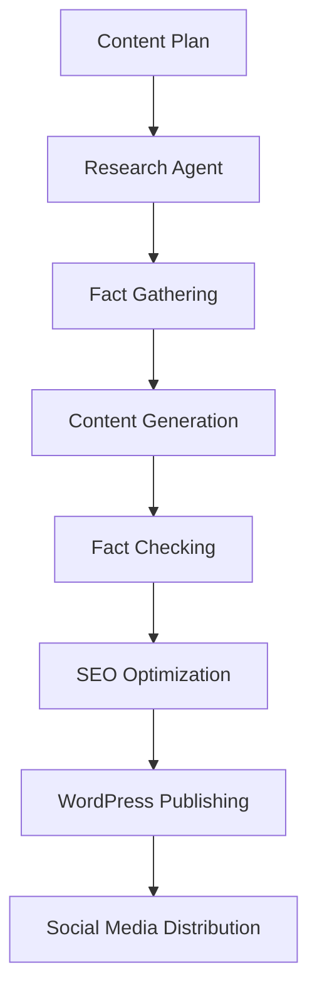

# PMW — LangGraph Agent Engine

Python-based AI agents for content research, creation, optimisation, and continuous improvement. LangGraph 1.0 with durable execution, checkpointing, and human-in-the-loop.

## 🤖 Overview

- **Framework**: LangGraph (production-ready, not Swarm)
- **Language**: Python 3.11+
- **LLM**: Claude (primary) / GPT-4o (fallback)
- **State**: PostgreSQL (LangGraph checkpointer)
- **Message Queue**: Redis (bridge to WordPress)
- **Observability**: LangSmith

## 📦 Installation
```bash
cd ai-agents
python -m venv venv
source venv/bin/activate  # On Windows: venv\Scripts\activate
pip install -r requirements.txt
```

## 🚀 Usage
```bash
# Run research agent
python -m agents.research_agent --topic "gold prices Q4 2024"

# Run content generation pipeline
python -m pipelines.content_pipeline --plan daily_content_plan.json

# Monitor agent workflows
python -m monitoring.dashboard
```

## 🏗️ Project Structure

```text
ai-agents/
├── agents/
│   ├── research_agent.py    # Research and fact-gathering
│   ├── content_agent.py     # Article generation
│   └── fact_checker.py      # Content verification
├── chains/
│   ├── research_chain.py    # Research workflows
│   ├── writing_chain.py     # Writing workflows
│   └── editing_chain.py     # Editing workflows
├── graphs/
│   └── content_workflow.py  # LangGraph state machine
├── tools/
│   ├── market_data.py       # Price data tools
│   ├── news_scraper.py      # News aggregation
│   └── seo_analyzer.py      # SEO optimization
├── config/
│   └── settings.py          # Configuration
└── requirements.txt
```

## 🔧 Configuration

```env
OPENAI_API_KEY=sk-...
ANTHROPIC_API_KEY=...
SERPAPI_API_KEY=...
REDIS_URL=redis://localhost:6379
```

## 📊 Agent Workflow


[Continue with detailed agent descriptions, API usage, monitoring...]
